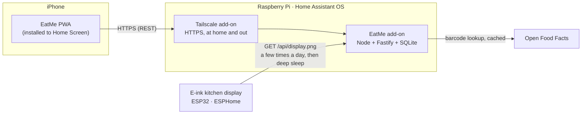

# EatMe 🫙

Never lose a jar at the back of the cupboard again.

EatMe is a self-hosted food inventory tracker for the stuff that gets forgotten — jars, spices, tins and dried goods. Add items by scanning their barcode with your phone, say how much is left with one tap, and let a battery-powered e-ink display in the kitchen quietly point out what needs eating first.

## What it does

- 📷 **Scan to add** — point the phone at a barcode; product details are filled in from Open Food Facts
- 🏷️ **QR labels for jars without barcodes** — decanted spices get printable QR labels; scan the lid to update that jar
- 🕰️ **Expiry & freshness tracking** — best-before dates, plus "opened 8 months ago" warnings for spices that fade long before the printed date
- 🫗 **How much is left** — quick-tap fractions: full / ¾ / ½ / ¼ / nearly empty / empty
- 🔎 **"Do I already have cumin?"** — search the cupboard from the supermarket
- 🍛 **Use-it-up recipes** — suggestions ranked by what is closest to going off
- 🛒 **Shopping list** — anything marked low or finished lands on the list
- 🖼️ **Kitchen e-ink display** — glanceable "eat me first" dashboard, months per battery charge

## How it fits together



Three parts, all optional beyond the first:

| Part | What it is |
|---|---|
| **Server** | TypeScript (Node 22 + Fastify + SQLite), packaged as a **Home Assistant add-on** so it runs on the HA Raspberry Pi already in the house. The inventory database lives in `/data`, so it is covered by normal HA backups. |
| **Phone app** | A **PWA** served by the server and installed to the iPhone Home Screen — no App Store, no Apple Developer account. Camera barcode scanning, offline-tolerant, Web Push notifications (iOS 16.4+). |
| **Display** | Any battery e-paper board that runs **ESPHome** (~60 lines of YAML) — it wakes a few times a day, fetches a server-rendered image, and deep-sleeps. Board choice is deferred and swappable; the current front-runner is the **Seeed reTerminal E1001** (7.5″, ESP32-S3, ~3-month battery). |

## Repo layout (planned)

```
eatme/
├── apps/
│   ├── server/      # Fastify API, display renderer, scheduled jobs
│   └── web/         # React PWA (Vite + vite-plugin-pwa)
├── packages/
│   └── shared/      # zod schemas & types shared by server and web
├── addon/           # Home Assistant add-on packaging (config.yaml, Dockerfile)
├── firmware/        # ESPHome YAML for the e-ink display
└── docs/            # the plan (start here)
```

## The plan

| Doc | Contents |
|---|---|
| [docs/01-product.md](docs/01-product.md) | What it does and why — user stories, features, freshness rules, data model |
| [docs/02-architecture.md](docs/02-architecture.md) | How it's built — API, HA add-on packaging, the HTTPS problem, display rendering |
| [docs/03-hardware.md](docs/03-hardware.md) | What to buy — e-ink device comparison and recommendation, ESPHome approach |
| [docs/04-roadmap.md](docs/04-roadmap.md) | Build order — nine phases, each independently useful |
| **[docs/plan/](docs/plan/README.md)** | **The executable build spec** — one file per phase, code skeletons, verified facts, acceptance checklists (built to be run by a smaller model) |

## Status

🚧 **In active build.** On `main` today:

- **Server** — TypeScript (Node 22 + Fastify + built-in SQLite) with numbered migrations run at boot.
- **Phone app** — installable PWA: cupboard list / search / one-tap fractions / add item / per-jar editing / settings, plus camera barcode scanning.
- **Home Assistant add-on** — packaged with bundled Tailscale so the iPhone reaches it over HTTPS, at home and away.
- **Data model** — products (identity) · stock lots (the physical packs you own) · QR containers · usage history. Freshness is tracked per-pack: a printed **use-by** (safety) is kept distinct from **best-before** and from an **opened → best-used-by** window (quality), so nothing is called "expired" without a real use-by.
- **Local receipt import** — photograph a receipt; it is read **entirely on your own hardware** (a local OCR engine — no cloud, ever), parsed, matched against what you already own (learning aliases as you confirm), and shown for review before anything is added.
- **Reliability pass** — every mutation is atomic and idempotent, so a flaky connection or a double-tap can't double-add or corrupt stock.

Run it locally with `pnpm install && pnpm dev`, then open `http://localhost:5173` (the API runs on `:8099`); install on the Pi via [`addon/DOCS.md`](addon/DOCS.md). Receipt OCR uses a built-in stub by default, so the whole flow works on a laptop with no Pi and no cloud.

**Next:** true offline (read a cached cupboard and queue changes with no signal, replayed on reconnect) → the e-ink kitchen display → use-it-up recipes & shopping list → Web Push reminders. Full sequence and per-phase specs in [docs/plan/](docs/plan/README.md).

MIT licensed.
