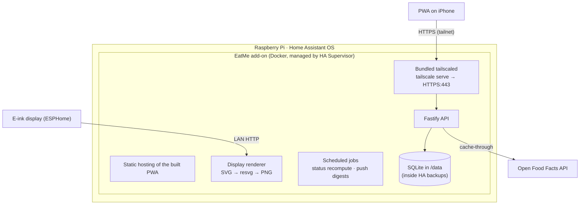
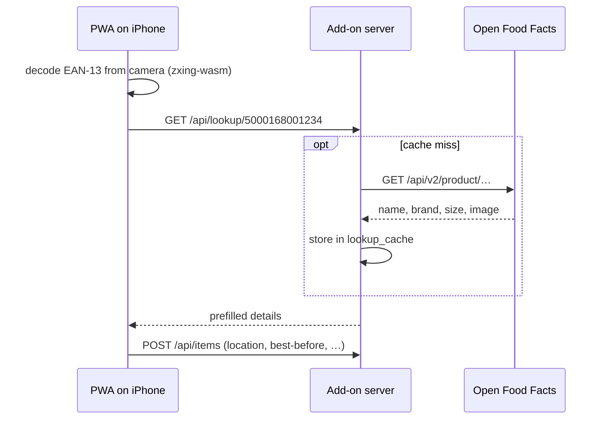

# 02 · Architecture

TypeScript everywhere, one server, one database file, no cloud dependencies (Open Food Facts aside). The server is a Home Assistant add-on because a Pi running HA OS is already on 24/7 in the house — no new hardware, and the database rides along in HA's normal backups.

## Components



**Monorepo** (pnpm workspaces):

- `apps/server` — Fastify, `node:sqlite` (built-in — no ORM, no native module to compile for the Pi), `@resvg/resvg-js` for display rendering, `web-push`, in-process scheduler. Serves the built PWA so app and API share one origin (no CORS, one URL to remember).
- `apps/web` — React + Vite + `vite-plugin-pwa`, Tailwind. Barcode scanning with the [`barcode-detector`](https://www.npmjs.com/package/barcode-detector) ponyfill (zxing-wasm) over a `getUserMedia` camera stream — iOS Safari has no native `BarcodeDetector`, so the ponyfill is load-bearing.
- `packages/shared` — zod schemas for every API payload; server validates with them, web infers types from them.
- `addon/` — HA packaging (below).
- `firmware/` — ESPHome YAML (see [hardware](03-hardware.md)).

## API sketch

| Endpoint | Purpose |
|---|---|
| `GET /api/items?q=&location=&status=&sort=urgency` | List/search inventory |
| `POST /api/items` · `PATCH /api/items/:id` | Add / update (fraction, opened, location…) |
| `POST /api/items/:id/events` | Append usage-log events (`finished`, `binned`, …) |
| `GET /api/lookup/:barcode` | Open Food Facts proxy with local cache |
| `GET /i/:qrUid` | QR-label target → redirects into the PWA at that item's quick-update screen |
| `GET /api/labels?ids=…` | Printable QR label sheet (HTML; print from the browser) |
| `GET /api/display.png` | Rendered e-ink dashboard PNG (800×480; optional `?panel=` for a second display) |
| `POST /api/push/subscribe` | Register a Web Push subscription |
| `GET /api/health` | For HA's watchdog |

**Open Food Facts**: `GET https://world.openfoodfacts.org/api/v2/product/{barcode}.json` — free, no key, good UK coverage including supermarket own-brands. Responses cached in `lookup_cache` forever (product names don't churn). Per OFF etiquette, send a real `User-Agent` (`EatMe/x.y (github.com/lewisf94/EatMe)`). Misses fall back to manual entry with the barcode kept, so the next identical jar still matches locally.

**Scan-to-add flow**:



## Display rendering

All layout happens server-side so the firmware stays dumb (and never needs reflashing to change the design):

1. A TS function builds an SVG string — "eat me first" top five, a use-it-up recipe, low-stock count, battery %, rendered date.
2. `@resvg/resvg-js` rasterises it to a greyscale PNG at exactly the panel's resolution (400×300 for the chosen XIAO ESP32-C3 + Waveshare 4.2″ — swap this constant for a different panel), using a bundled font so output is identical on the fontless Pi.
3. The ESP32-S3 wakes on a timer, `GET /api/display.png` over plain LAN HTTP, draws it, reports battery, and deep-sleeps (~6h). Stale-by-hours is fine for a cupboard.

A `?panel=` parameter (a P9 extension) lets a second/different display request its own resolution and layout.

## HA add-on packaging

An HA OS add-on is a Docker image plus a manifest. `addon/config.yaml` sketch:

```yaml
name: EatMe
slug: eatme
version: 0.1.0
description: Food inventory for jars, spices, and the back of the cupboard
arch: [aarch64, amd64]        # Pi 4/5 and dev machines
init: false
ports:
  8099/tcp: 8099
webui: http://[HOST]:[PORT:8099]
watchdog: http://[HOST]:[PORT:8099]/api/health
options:
  auth_token: ""              # optional bearer token
  tailscale_authkey: ""       # enables the bundled HTTPS (P4)
  tailscale_hostname: "eatme"
  anthropic_api_key: ""       # optional, for LLM suggestions (P9)
schema:
  auth_token: str?
  tailscale_authkey: password?
  tailscale_hostname: str?
  anthropic_api_key: str?
```

- **Install path**: copy `addon/` to `/addons/eatme` on the Pi (via the Samba or SSH add-on) → it appears under *Settings → Add-ons → Local add-ons* and the Supervisor builds it on-device for the Pi's architecture. Later, the repo itself can be added as a custom add-on repository so updates are one click.
- **Persistence**: the server writes SQLite to `/data`, the Supervisor-managed volume that is included in HA backups automatically.
- **Base image**: `node:24-alpine`. Both `node:sqlite` (built-in) and `@resvg/resvg-js` (prebuilt musl-arm64 binary) work there with **no native compilation** — precisely why they were chosen over better-sqlite3/sharp. The image also bundles the `tailscale`/`tailscaled` binaries (see below).

## HTTPS and remote access

The one genuinely awkward constraint: **camera access, service workers and Web Push all require a secure context.** `http://homeassistant.local:8099` is not one, so over plain LAN HTTP the PWA can't scan barcodes or install properly.

**Recommended: the add-on bundles its own `tailscaled` and runs `tailscale serve` itself.**

> ⚠️ Why not just point the existing HA Tailscale add-on at us? Because it **only serves Home Assistant itself** (ports 443/8443/10000) — verified July 2026. It can't reverse-proxy another add-on or share its cert. So we bundle Tailscale into our own container.

- Our add-on ships the Tailscale binaries and joins the Pi to a private tailnet in userspace mode (auth key pasted into the add-on config; free tier: 100 devices, 3 users).
- Inside the container, `tailscale serve --bg --https=443 http://127.0.0.1:8099` puts a real, auto-renewed certificate in front of the Node server at `https://<hostname>.<tailnet>.ts.net`. Nothing is exposed to the public internet (Serve, not Funnel).
- The iPhone runs the Tailscale app, so **the same URL works at home and in the supermarket** — which the "do I already have this?" story needs anyway. One URL, installable PWA, camera and push all happy.
- The e-ink display keeps using plain LAN HTTP (ESPHome has no secure-context rules), so it needs no Tailscale.
- Requires MagicDNS + HTTPS certificates enabled on the tailnet. Exact `tailscale serve` flags vary by version — [P4](plan/04-phase-ha-addon.md) confirms them with `tailscale serve --help`.

Alternatives, for the record:

| Option | Verdict |
|---|---|
| Nabu Casa remote + add-on ingress | Already-paid-for remote HTTPS, but ingress URLs are tokenised paths under the HA UI — poor fit for an installable standalone PWA. Fine as a read-only fallback. |
| DuckDNS + Let's Encrypt + NGINX add-ons | Works, but public exposure + port forwarding + three add-ons of moving parts. Not worth it for a household app. |
| Self-signed certificate | iOS treats self-signed PWAs badly (trust prompts, flaky service workers). Avoid. |

## Auth & security posture

Household app on a private network: **v1 ships with no login screen.** Reachability *is* the perimeter — LAN + tailnet only, nothing port-forwarded. The optional `auth_token` add-on option adds a bearer-token check (the PWA stores it once in settings) as belt-and-braces, e.g. if the LAN has untrusted guests. Multi-user accounts stay a non-goal; anyone in the household pointing at the same URL sees the same cupboard, which is the desired behaviour.

## Notifications

`web-push` + VAPID keys (generated on first boot, stored in `/data`). iOS supports Web Push for Home-Screen-installed web apps since 16.4 — the app must be installed (not just open in Safari), which the HTTPS setup above already ensures is smooth. In-process cron sends: a Monday-morning digest of the week's "use soon" items, and day-before alerts for hard-expiry items only. Quiet by default; nagging kills these apps.

---

Next: [03 · Hardware](03-hardware.md)
